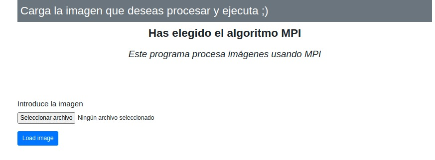

# Parallel_Web_Service

#### Alberto Martín Núñez

## Indice de contenidos

1. [Objetivo de la práctica](#id1)
2. [Herramientas usadas y metodología](#id2)
3. [Web Service](#id3)
4. [Service Programs](#id4)
5. [Web API Service](#id5)
6. [Conclusiones](#id6)

## Objetivo de la práctica 

El objetivo de esta práctica es desarrolla un pequeño **Framework** orientado al servicio que permita poner a disposición de un usuario final las rutinas paralelas que he desarrollado en la asignatura para el procesamiento de imágenes (versiones MPI y OpenMP).

## Herramientas usadas y metodología 

Para realizar esta práctica se ha hecho uso de **Flask** un micropframework de Python que nos permite crear aplicaciones web sencillas y de fomar bastante ligera bajo el patron MVC, el cual nos permite trabajar de forma que podemos diferenciar y separar el modelo de datos(BD), la vista(HTML) y el controlador(peticiones web).

Para el **Login** se ha creado una base de datos en **MongoDB**

Como vamos a tener diferentes servicios se crean tres carpetas en donde cada una alojará un servicio diferentes, en este caso tenemos:

- Web_service
- Service_programs
- Web_API_service

## Web_Service 

Este servicio se encargará de proporcionarnos una web en donde vamos a poder un Login a la base dedatos Mongo. Al ingresar los datos correctos accederemos a la web en donde podremos visualizar los dos opciones que tenemos para ejecutar en paralelo(*mpi y openmp*).

*Estos archivos tienen que estar en a misma carpeta del servicio web*

Ahora podemos seleccionar el algoritmo paralelo que queremos utilizar para procesar nuestra imagen. Al seleccionar uno de ellos, accederemos a un formulario en onde podremos añadir la imagen que queremos procesar y cargarla en nuestro servicio *Service_programs* que se explicará posteriormente.

Imaginemos que seleccionamos la opcion de *mpi*, esto nos llevaría a la siguiente página:

## Service_programs 

## Web_API_service 

## Conclusiones 
