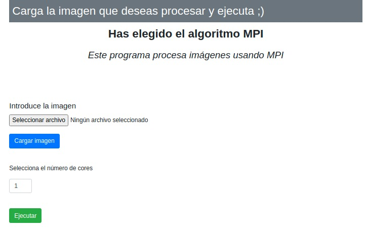
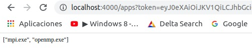

# Parallel Web Service


#### Alberto Martín Núñez

## Indice de contenidos

1. [Objetivo de la práctica](#id1)
2. [Herramientas usadas y metodología](#id2)
3. [Web Service](#id3)
4. [Service Programs](#id4)
5. [Web API Service](#id5)


## Objetivo de la práctica <a name="id1"></a>

El objetivo de esta práctica es desarrolla un pequeño **Framework** orientado al servicio que permita poner a disposición de un usuario final las rutinas paralelas que he desarrollado en la asignatura para el procesamiento de imágenes (versiones MPI y OpenMP).

## Herramientas usadas y metodología <a name="id2"></a>

Para realizar esta práctica se ha hecho uso de **Flask** un micropframework de Python que nos permite crear aplicaciones web sencillas y de fomar bastante ligera bajo el patron MVC, el cual nos permite trabajar de forma que podemos diferenciar y separar el modelo de datos(BD), la vista(HTML) y el controlador(peticiones web).

Para el **Login** se ha creado una base de datos en **MongoDB**

Como vamos a tener diferentes servicios se crean tres carpetas en donde cada una alojará un servicio diferentes, en este caso tenemos:

- Web_service
- Service_programs
- Web_API_service

## Web_Service <a name="id3"></a>

Este servicio se encargará de proporcionarnos una web en donde vamos a poder un Login a la base dedatos Mongo. Al ingresar los datos correctos accederemos a la web en donde podremos visualizar los dos opciones que tenemos para ejecutar en paralelo(*mpi y openmp*).

*Estos archivos tienen que estar en a misma carpeta del servicio web*


Ahora podemos seleccionar el algoritmo paralelo que queremos utilizar para procesar nuestra imagen. Al seleccionar uno de ellos, accederemos a un formulario en onde podremos añadir la imagen que queremos procesar y cargarla en nuestro servicio *Service_programs* que se explicará posteriormente.

Imaginemos que seleccionamos la opcion de *mpi*, esto nos llevaría a la siguiente página:




En donde como es el caso de *mpi* podemos seleccionar el número de cores a utilizar. Este campo tiene como minimo el valor 1 y como maximo 8.

Una vez seleccionado el numero de cores pulsamos en el boton *ejecutar* y se ejecutaria nuestro programa mostrandonos por pantalla el resultado de la imagen.


Esta imagen se queda guardada en nuestro servicio **Service_programs** y además se devuelve y se guarda en nuestro **Web_service** en la ruta *static/temp/output.jpg*.


## Service_programs <a name="id4"></a>

Este servicio se encarga de ejecutar nuestros programas de **openmp** y **mpi**. El método más interesante se describe a continuación:

```python

@app.route('/exec/<name>', methods = ['POST'])
def execute(name):
    params = request.get_json()
    print(params)
    if params['algoritmo'] == 'mpi':
        os.popen('mpirun -n ' + str(params['num_cores']) + ' ./mpi.exe ' +  params['input_image'] + ' ' + params['output_image']).read()
    else:
        os.popen('./openmp.exe ' +  params['input_image'] + ' ' + params['output_image']).read()

    return send_file(params['output_image'])
```
Este metodo obtiene la información que enviamos al pulsar el boton de "ejecutar". Esta recibe la informacion del JSON que tiene la siguiente estructura:

```json
    "algoritmo": "mpi",
    "input_image": "name_file", 
    "output_image": "image_out_mpi.jpg",
    "num_cores": "num_cores
```

*Este sería el caso de mpi*

Comprobamos que método se ha escogido con `params['algoritmo']` y dependiendo del algoritmo ejecutamos una u otro utilizando la función `os.popen()`.

Y por último retornamos la imagen que se ha creado en nuestro *Service_programs*.


## Web_API_service <a name="id5"></a>

Este servicio consiste en tratar las peticiones de usuarios que no se conecten a nuestro servicio web sino que quieran usar el servicio de *Service program* directamente. De esta forma protegemos nuestro servicio y solo se lo ofrecemos a los usuarios que queramos.

Lo primero que se debe hacer es hacer una función que compruebe si existe un token y es válido.
Esto lo hacemos de la siguiente manera:

```python
def token_required(f):
    @wraps(f)
    def decorated(*args, **kwargs):
        token = request.args.get('token')

        if not token:
            return jsonify({'message': 'No hay token'}), 403

        try:
            data = jwt.decode(token, app.config['SECRET_KEY'])
        except:
            return jsonify({'message': 'token invalido'}), 403

        return f(*args, **kwargs)

    return decorated

```

Lo siguiente que debemos hacer es proteger el *login* de tal forma que si un usuario va a la ruta */login* deberá conectarse con un **usuario** y una **password** para poder acceder al servicio. Si la contraseña es correcta se le mostrará el **token** que puede utilizar para acceder a los métodos de la siguiente forma:

*localhost:4000/apps?token=xxxxxxxxxxxxxx*



En caso de que no se haya obtenido el token, el usuario no podrá acceder a los métodos. El token que se obtiene tiene una cadicidad, para este caso se le ha puesto una duración de treinta minutos.

La contraseña en este caso esta definida en el propio código pero lo suyo es que este en una base de datos juntos con el nombre del usuario. En este caso la contraseña es *password*.


Un ejemplo para el método */apps* que devuelve los ejecutables que existen solo habría que crear un método que llame al propio método del servicio y añadirle **@token_required**.

```python
@app.route('/apps')
@token_required
def apps():
    r = requests.get('http://localhost:5000/apps')
    data = r.text
    return data
```